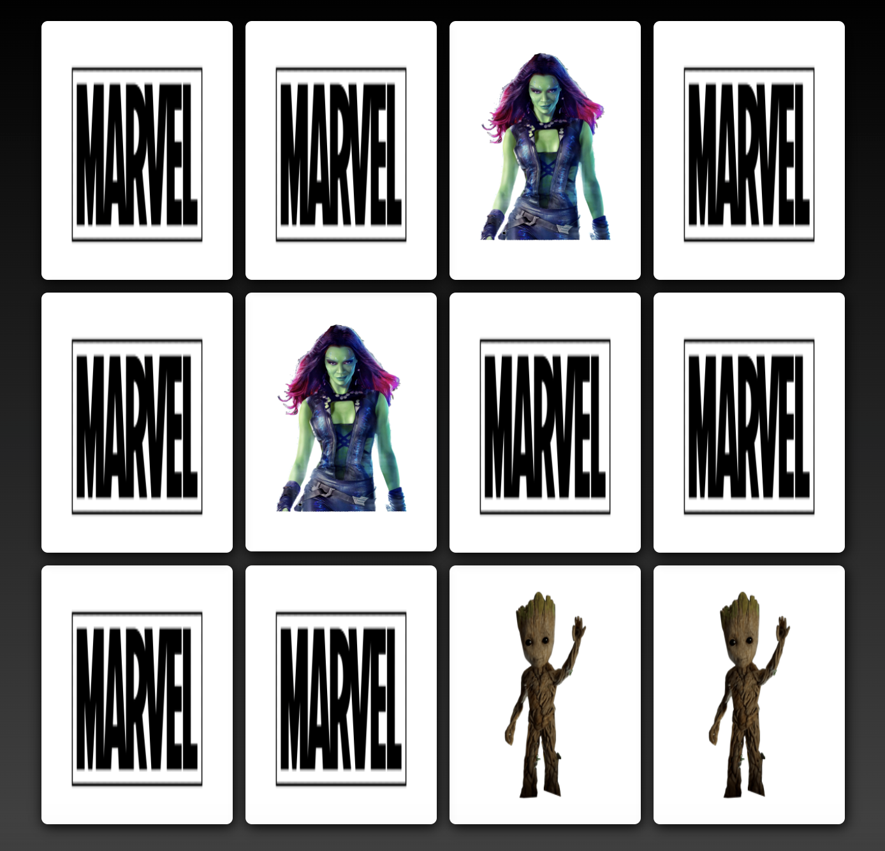

# Memory Card Game with JS

### Instructions:
Test your memory with this memory game. On the game board, there are always two identical images. Start the game by flipping a card. Then try to find another card that has the same image as the first. If you can't find a pair, the flipped cards will be flipped back with the face down. Try to remember these images as it becomes easier to find pairs the longer you play. When you find all the pairs in this memory, you have completed the game.

### Technologies:
  - HTML
  - CSS
  - JavaScript
  
  Visit this link to check this website: https://memory-card-game-js.netlify.app/
  
  
  
  
  
